# semeval2023-afrisenti
A low-resource sentiment analysis project for African Languages

### Getting started
1. Clone the repo and `cd` to project directory
2. Install python -- version 3.8
2. Run the command `python -m venv .venv` to setup the virtual environment
3. Activate the virtual environment using `source .venv/bin/activate` 
4. Install the requirements `pip install -r requirements.txt`

Project Organization
------------

    ├── LICENSE
    ├── Makefile           <- Makefile with commands like `make data` or `make train`
    ├── README.md          <- The top-level README for developers using this project.
    ├── data
    │   ├── external       <- Data from third party sources.
    │   ├── interim        <- Intermediate data that has been transformed.
    │   ├── processed      <- The final, canonical data sets for modeling.
    │   └── raw            <- The original, immutable data dump.
    │
    ├── docs               <- A default Sphinx project; see sphinx-doc.org for details
    │
    ├── models             <- Trained and serialized models, model predictions, or model summaries
    │
    ├── notebooks          <- Jupyter notebooks. Naming convention is a number (for ordering),
    │                         the creator's initials, and a short `-` delimited description, e.g.
    │                         `1.0-jqp-initial-data-exploration`.
    │
    ├── references         <- Data dictionaries, manuals, and all other explanatory materials.
    │
    ├── reports            <- Generated analysis as HTML, PDF, LaTeX, etc.
    │   └── figures        <- Generated graphics and figures to be used in reporting
    │
    ├── requirements.txt   <- The requirements file for reproducing the analysis environment, e.g.
    │                         generated with `pip freeze > requirements.txt`
    │
    ├── setup.py           <- makes project pip installable (pip install -e .) so src can be imported
    ├── src                <- Source code for use in this project.
    │   ├── __init__.py    <- Makes src a Python module
    │   │
    │   ├── data           <- Scripts to download or generate data
    │   │   └── make_dataset.py
    │   │
    │   ├── features       <- Scripts to turn raw data into features for modeling
    │   │   └── build_features.py
    │   │
    │   ├── models         <- Scripts to train models and then use trained models to make
    │   │   │                 predictions
    │   │   ├── predict_model.py
    │   │   └── train_model.py
    │   │
    │   └── visualization  <- Scripts to create exploratory and results oriented visualizations
    │       └── visualize.py
    │
    └── tox.ini            <- tox file with settings for running tox; see tox.readthedocs.io

--------

<small>Project based on the <a target="_blank" href="https://drivendata.github.io/cookiecutter-data-science/">cookiecutter data science project template</a>. #cookiecutterdatascience</small>

## Introduction
Due to the widespread use of the Internet and social media platforms, most languages are becoming
digitally available. This allows for various artificial intelligence (AI) applications that enable tasks such
as sentiment analysis, machine translation and hateful content detection.
Despite its success, NLP technology is only widely available for high-resource languages such as
English, while it remains inaccessible to many languages due to the unavailability of data resources
and benchmarks. Further research is required to determine both the suitability of current natural
language processing (NLP) techniques and the development of novel techniques to maximize the
applications of such datasets.
According to UNESCO (2003), 30% of all living languages, around 2,058, are African languages.
However, most of these languages do not have curated datasets for developing such AI applications.
We aim to work on sentiment analysis in a low resource setting for the AfriSenti-SemEval Task 2023
(https://afrisenti-semeval.github.io/). This is an African-language sentiment analysis task. The dataset
consists of Twitter tweets in 14 African languages. There are 3 subtasks in this SemEval task. We
want to do the first subtask, Task A. Task A will tell whether a tweet expresses positive or negative
sentiment, and if a tweet expresses two sentiments at the same time, then it will tell which sentiment
is stronger.

## Problem Statement
Given training data in a target language, perform Sentiment Analysis in a low resource setting and
improve the prediction capabilities from existing baselines.
Challenges associated to low resource language projects include:
- Low availability of dataset
- Twitter API does not support these
languages
- Crawling is difficult
- Code-mixing (English language mixed
in between African languages)
- Skewed class distribution
- Limited understanding of the languag

## Dataset
Tweets in 9 African languages
- Labeled with 3 sentiment classes (positive, negative, neutral)
- Annotated by three annotators following the annotation guidelines in (Mohammad, Saif M, 2016)
- Source: AfriSenti-SemEval: Sentiment Analysis for Low-resource African Languages using Twitter
Dataset

## Exploratory Data Analysis

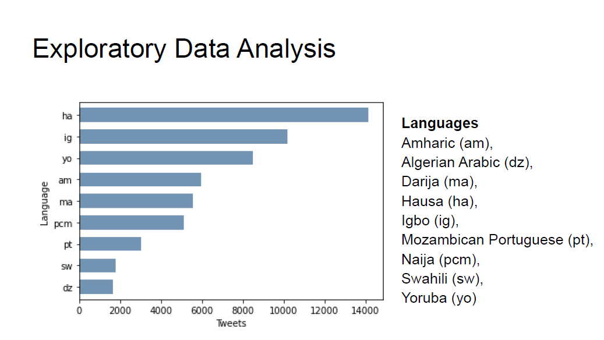  

Due to the lack of understanding of African languages, for our initial interpretation of the meaning of
tweets and to understand the data, we converted the 9 chosen African languages into the English
language. We used google translate to convert the text to English. Our translated data contains
unicode and other unknown special characters, as well as words that are not in the English dictionary.
This was the best google translate worked for the provided data.

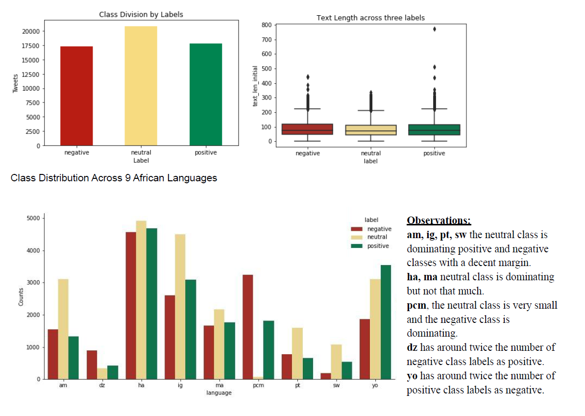  

WordClouds
The word clouds for 9 African languages can be seen here. Top words from each class label has
been represented as per the color legend. The three languages (AM, DZ and MA) have romanized
scripture. We observe a high overall weightage of neutral words.

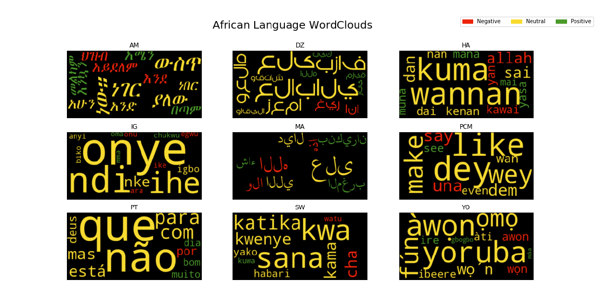  

The word clouds for translated text have also been shown below for better interpretation.

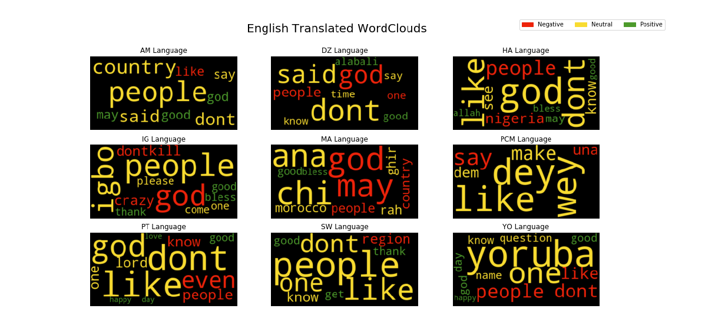  

The English translated word clouds show a better output with stop word removal incorporated. Some
words that were not translated into English are the same across both word clouds as they have been
highly used in the corpus.

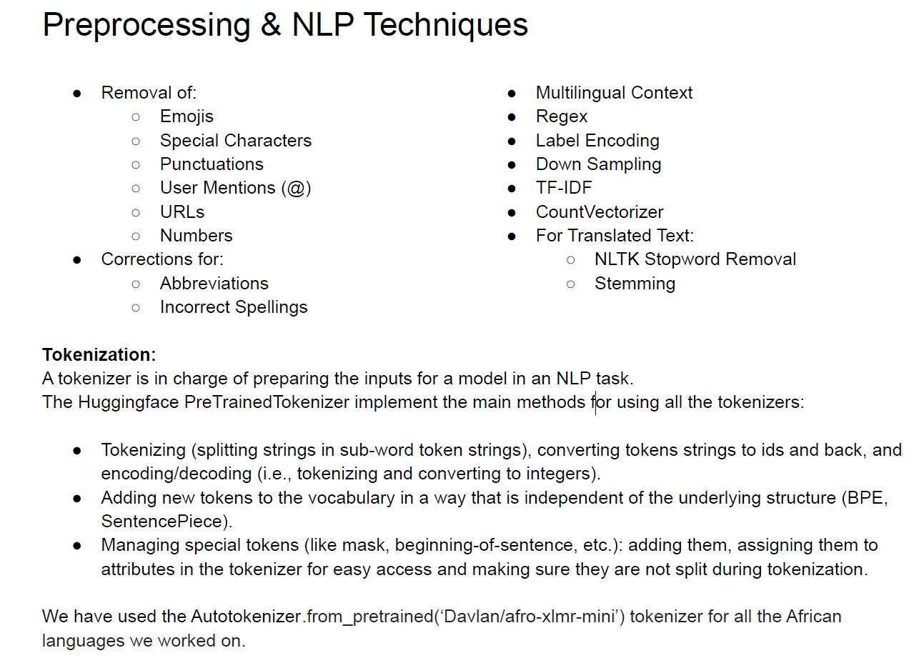  

## Evaluation Metrics
We use the following evaluation metrics to evaluate and compare the results. However, we mostly refer
to the weighted F1 score to compare performance across all the datasets under a single metric.
- Accuracy - Accuracy is the most intuitive performance measure and it is simply a ratio of
correctly predicted observations to the total observations.
- Precision - Precision is the ratio of correctly predicted positive observations to the total predicted
positive observations.
- Recall (Sensitivity) - Recall is the ratio of correctly predicted positive observations to the all
observations in actual class
- F1 Score - F1 Score is the weighted average of Precision and Recall. Therefore, this score takes
both false positives and false negatives into account. Intuitively it is not as easy to understand as
accuracy, but F1 is usually more useful than accuracy, especially if you have an uneven class
distribution. F1 Score = 2 * (Recall * Precision) / (Recall + Precision)

## Individual Language Evaluation
## Language 1: Naija (pcm)
Approach and Analysis
Naija or Nigerian Pidgin is an English-based language that is used in Nigeria for communication
between multiple ethnic groups that do not share a common language. Although it has not been granted
an official status in Nigeria, it is one of the biggest languages in Africa in terms of the population that
uses them. According to a tentative estimate, over 1 million people use it as their first language while it is
a second language for over 40 million people (Faraclas, Nicholas C., 1996). Since it is based on English,
Naija is written in Roman-script and shares some of the vocabulary with English. The following table
shows the comparison between the pcm language and its English translation.

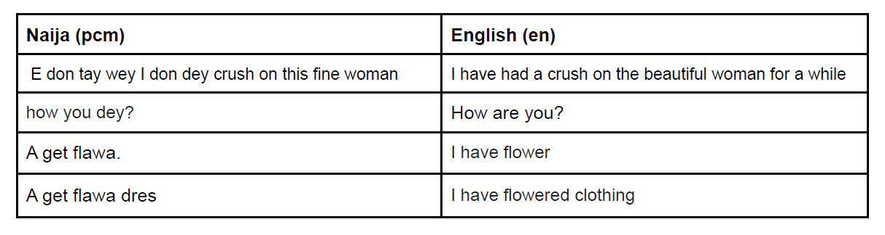  

Although both English and Naija share significant vocabulary, the grammar for Naija is different from the
English grammar. More specifically, Naija language has no adjectives and most of the noun modifiers
are taken from some other class like noun or verbs. The fourth example above shows that the word
flaws which refers to flowers in English is also used to mean the adjective flowered. And the usage of
verbs and adverbs also vary significantly from the English language.
In order to see how much similarity Naija shares with the English language, we first evaluated the
dataset on the finiteautomata/bertweet-base-sentiment-analysis which is a BERT based model on
huggingface trained on English language tweets for sentiment analysis. The table in the results section
shows the results for this model. It can be seen that, here the recall for neutral class is significantly
greater than its precision while the trend is reverse for the other two classes. This is probably because
the difference is the use of adjectives in the English language and Naija. Since adjectives are the most
important part of speech in depicting the sentiment in English language and Naija does not have
adjectives, most of the text is classified as neutral.
We then trained a LinearSVM model to establish a baseline for the Naija dataset. Here we used the
tokenizer provided in the task to generate tokens. The features for LinearSVM were generated using
TfIdf vectorizer with 1 and 2 gram tokens. The results for LinearSVM are shown in the results table.
Then, we evaluated the XLM model Davlan/afro-xlmr-mini which was given in the task as an alternative
baseline. The LinearSVM model outperformed the deep learning baseline in terms of accuracy and
macro-F1 score.
We hypothesized that the poor performance of the Afro-XLMR model was due to the lack sufficiently
large training dataset as the model could not learn accurate representation of the Naija vocabulary. So,
we then used a model pretrained on the Naija senti dataset. Indeed, with this model the weighted F1
increased by 0.07. Finetuning the masked language modeling objective of the pretrained Roberta further
on our training dataset, led to further improvement in the F1-score. So, it was observed that the
performance of deep learning models particularly those based on large language models largely
depends on the size of the training dataset.
Results
The data distribution for pcm has 63% of the data in negative class, 36% in positive and only 1% in
neutral. Furthermore the overall dataset contains 5121 examples. Given the skewed distribution with the
neutral class being non-dominant, the weighted F1 score is the preferred metric of evaluation for this
dataset. The table below shows the results for the different approaches described in the previous
section.

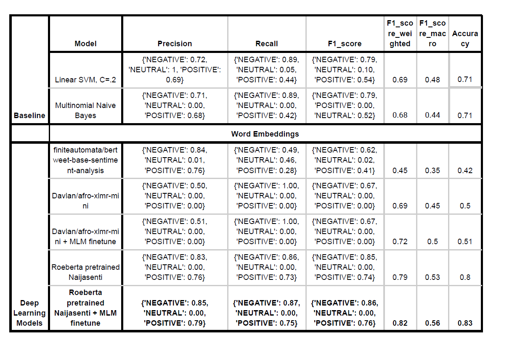  

## Language 2: Igbo (ig)
Approach, Dataset, Igbo language and Algorithm:
The train set has been chosen instead of dev set, because it has labels/classes.
Observations of the Igbo dataset: Fig1 is an image of the test subset from the splitted-train-dev-test
folder. You can see that the reviews are short, and contain capital letters, punctuations, hashtags, urls
and emojis. You can also see that some punctuations are tightly attached to words without spaces in
between, like in line 47 “okwukwe!!!!!!”, which will be recognized as a different word than “okwukwe”. If
the word “okwukwe” is a sentiment lexicon and it is not recognized due to punctuations, this may
misclassify reviews.
Observations of lexicons: the lexicons contain \u200d and whitespace-like characters, as shown in the
images below (Fig2, Fig3). In the predict_by_lexica() method, I added whitespaces before and after
each lexicon to avoid some words that contain the lexicon but not the lexicon itself.
About Igbo language: Fig4 shows the Igbo alphabets, as you can see, they have some “punctuations”
on top or below. When removing punctuations, these will not be filtered.
I used the algorithm from page 15 of chapter 20 from our textbook.
Results and Analysis:
Surprisingly, the performance of the Davlan/naija-twitter-sentiment-afriberta-large model on the Igbo
train dataset is better than that for Igbo on the HuggingFace Naija website. It performed best among the
models I tried because it is trained on languages including the Igbo language.
For the lexicon based models, the best one is the one with lexicons cleaned and reviews lower-cased.
As in Fig5, the punctuation “-” seems to correspond with “-ing” in English. This is why I did not remove
“-“ and “’”, as they seem to contain important semantic meanings. Nevertheless, removing punctuations
still performed not as good, same with removing stopwords. The reasons are unclear. However,
interestingly, according to the fifth experiment, when removing punctuations together with stopwords the
performance is better than just removing punctuations, the reason is not clear. Also, the fourth
experiment performs badly, maybe because my regex is not that right. The lexicon based did not
perform as good as the Davlan/naija-twitter-sentiment-afriberta-large model, maybe because the reviews
contain fewer sentiment bearing words due to their lengths and also because both good and bad
reviews contain positive and negative sentiment lexicons.
The afro-xlmr-mini and other models performed okay. The reasons are unknown.
In the future, I want to try the emotion lexicons provided in this github
https://github.com/hausanlp/NaijaSenti. I expect this will improve performance because we now have
more sentiment bearing words.
***For more details regarding how to run code, location of datasets etc, please visit here. Also access
images discussed below here.***
The detailed results of all the models can be seen in the figure below.

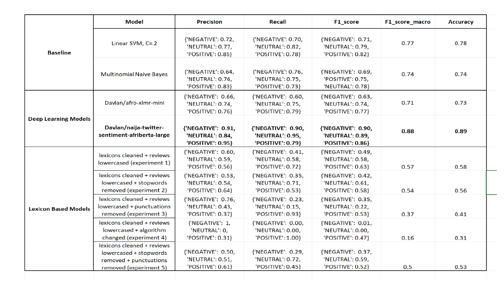  

## Language 3: Amharic (am)
Approach
In general if someone wants to express negative sentiment they do mention it in many sentences. So,
we decided to check if the Amharic text sentiment relates to the length of the text. We created a boxplot
of text length for each label.

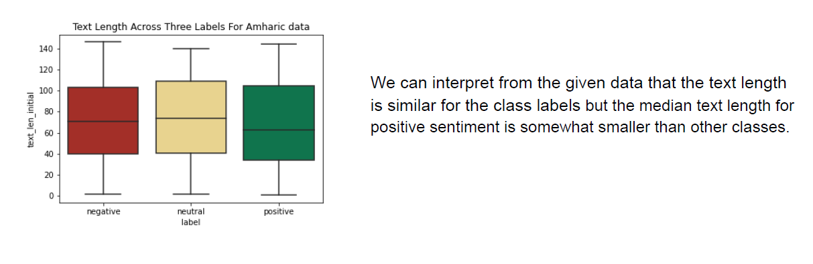  

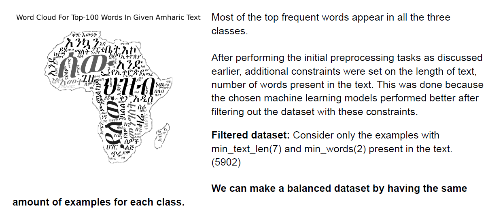  

- Under-Sampling: The examples from the class with minimum size are kept and extra examples
from the majority classes are removed. (Can choose at random)
- Over-Sampling: The examples from the class with maximum size are kept and the examples
from the minority classes are increased to that number. (sampling with replace=True). But this
results in producing duplicate data. (The model performance is not good). Another technique
called SMOTE didn't work with raw text.
Under Sampling
As we had more samples in the neutral, negative classes, we did sampling without replacement from
them to match the positive class. But used a specific random_state(1) for reproducibility of the results.
Baseline models
We checked the following model strategies as baselines for Amharic:
- Stratified: Generates predictions based on the training set's class distribution.
- Uniform: Generates predictions uniformly at random.
- Most frequent: Always predicts the most frequent label in the training set.
Machine Learning models
- Linear Support Vector Classifier (SVC): applies a linear kernel function to perform
classification. TF-IDF representations of the words are considered as features.
- Multinomial Naive Bayes: uses the bayes theorem for classification and considers the
features(token counts) are independent of each other.
Deep Learning models
We have used variations of the RoBERTa models for sentiment classification.
xlm-roberta-base-finetuned-amharic is a Amharic RoBERTa model obtained by fine-tuning
xlm-roberta-base model on Amharic language texts. It provides better performance than the
XLM-RoBERTa on named entity recognition datasets.
Contextual string embeddings are powerful embeddings that capture latent syntactic-semantic
information that goes beyond standard word embeddings.
The key differences are:
- They are trained without any explicit notion of words and thus fundamentally model words as
sequences of characters.
- They are contextualized by their surrounding text, meaning that the same word will have different
embeddings depending on its contextual use.

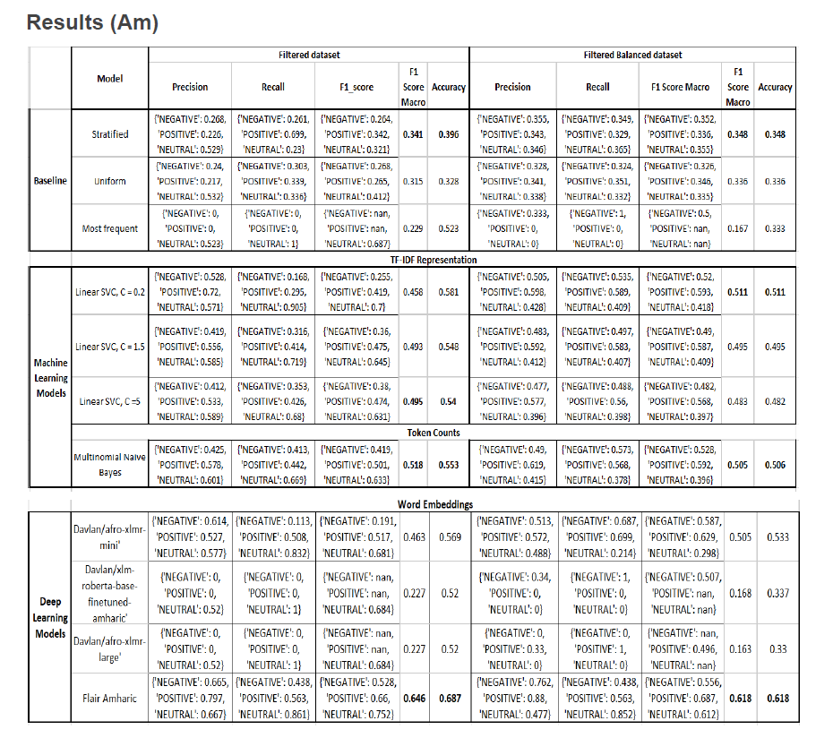  

Analysis
As the neutral class was dominating the positive and negative classes, just predicting the neutral class
gave the accuracy of 0.523, but the f1-score was 0.229 which suggests that we can’t just use accuracy
while selecting the model.
Used the Multinomial Naive Bayes classifier with a “Bag of Words” representation as features.
Bag of Words is a simplified feature extraction method which uses only the frequency of the word
appearance in the document. This is obtained by using CountVectorizer method which convert a
collection of text data to a matrix of token counts.This model gave accuracy value of 0.553 and f1-score
of 0.518
But this approach results in biasing in favor of most frequent words. “TF-IDF” (Term Frequency Inverse
Document Frequency) representation was used to counter this limitation.
Using TfidfVectorizer we consider the overall document weightage of a word. It helps us in dealing with
the most frequent words. Using it we can penalize them. TfidfVectorizer weights the word counts by a
measure of how often they appear in the documents. Then used these representations to fit the Linear
SVC for various values of C penalty hyper-parameter. Did Linear SVC with C = [0.2,1.5,5,7,
10,100] for modeling purposes but displayed the results of models with C = [0.2, 1.2, 1.5] in the results
summary image. We can clearly see that with a balanced distribution in the dataset, the model was able
to fit better for a lower value of C=0.2 compared to the Linear SVC model with C=5 on the non balanced
dataset.
But these models ignore various abstractions of natural language such as grammar and word sequence
and do a poor job in making sense of text data. For example, consider the two English sentences: "I love
playing football and hate cricket" and it's vice-versa "I love playing cricket and hate football". These will
result in similar vectorized representations although both sentences carry different meanings.
Attention-based deep learning models like BERT are used to solve the problem of contextual
awareness.
From the results the “xlm-roberta-base-finetuned-amharic” model didn’t provide better results. The
reason is that this model is limited by its training dataset of entity-annotated news articles from a specific
span of time and did not generalize well for our use case(Twitter sentiment texts)
The Davlan/afro-xlmr-mini model gave decent results but when the Davlan/afro-xlmr-large was used the
predictions were biased towards a single class label.
Flair Amharic model which is the Amharic RoBERTa transformer-based LM which used the contextual
string embeddings gave better results with accuracy of 0.687 and f1-score of 0.646.

## Language 4: Hausa (ha)
Approach
Preprocessing:
Performed step by step cleaning of data for both raw African text data as well as translated English text
as per the preprocessing steps defined in above. Along with that the top N words were evaluated
through tokenization of words using MultiLabelBinarizer and CountVectorizer. Weights were assigned to
words that held high weightage as per the normalization by each label and TF-IDF was calculated.
Baseline Models:
Linear Support Vector Classifier (SVC) - a method that applies a linear kernel function to
perform classification and functions well with a large number of samples. If we compare it with
the SVC model, the Linear SVC has additional parameters such as penalty normalization which
applies 'L1' or 'L2' and loss function. The best model parameters in this case were C = 0.2 and
CV=10. This model gave a macro F1 score of 0.74 and accuracy of 0.74.
Multinomial Naïve Bayes - a probabilistic learning method and one of the most popular
supervised learning classifications used for the analysis of categorical text data. It calculates the
probability of each tag for a given sample and then gives the tag with the highest probability as
output. This model gave a macro F1 score of 0.72 and accuracy of 0.72.
Deep Learning Models:
Davlan/AfroXLMR- mini – which was created by MLM adaptation of XLM-R-miniLM model on
17 African languages.
Naija-twitter-sentiment-afriberta-large – the first multilingual twitter sentiment classification
model for four (4) Nigerian languages (Hausa, Igbo, Nigerian Pidgin, and Yorùbá) based on a
fine-tuned castorini/afriberta_large large model. The model has been trained to classify tweets
into 3 sentiment classes: negative, neutral and positive Specifically, this model is a
xlm-roberta-large model that was fine-tuned on an aggregation of 4 Nigerian language datasets
obtained from NaijaSenti dataset.
Ahmadmwali/finetuning-sentiment-hausa-4 – a model that is a fine-tuned version of
castorini/afriberta_large on an unknown dataset.
Davlan/xlm-roberta-base-finetuned-hausa – a Hausa RoBERTa model obtained by fine-tuning
xlm-roberta-base model on Hausa language texts. It provides better performance than the
XLM-RoBERTa on text classification and named entity recognition datasets. This model is a
xlm-roberta-base model that was specifically fine-tuned on Hausa corpus.
Analysis
The Hausa language has the largest data size among other languages in our dataset as seen in the
class distribution part of the exploratory data analysis section above.
The Neutral class was slightly dominant than the Positive and Negative classes but overall the data did
not have any imbalanced class problem.
Using the Macro Average F1 Score as the primary evaluation metric, we analyze the results below.
The Linear SVC model and Multinomial Naive Bayes model were first run on preprocessed data and the
Linear SVC model performed slightly better than the Multinomial Naive Bayes model with an F1 score of
0.74.
Between the Ahmadmwali/finetuning-sentiment-hausa-4 and the Davlan/AfroXLMR- mini models, there
is a somewhat improvement by the Ahmadmwali/finetuning-sentiment-hausa-4 model that achieves the
a macro F1 score of 0.76 and accuracy of 0.76 while the Davlan/AfroXLMR- mini model gave a macro
F1 score of 0.72 and accuracy of 0.72.
Of all the models, we noticed that the pretrained Davlan/naija-twitter-sentiment-afriberta-large model
outperformed all other Baseline as well as Deep Learning models, with an F1 score of 0.96. The biggest
reason for the great performance of this model could be the availability of large size of data for this
language.
For our dataset the Davlan/naija-twitter-sentiment-afriberta-large model performs better overall on
Hausa than the other three languages trained on it. It has also been said to outperform other existing
models for the twitter sentiment classification task trained on the NaijaSenti corpus.
Additionally, we observe from the results how the Davlan/xlm-roberta-base-finetuned-hausa is the worst
performer of all and returns even poorer results than the Baseline models.
The detailed results of all the models can be seen in the table below.

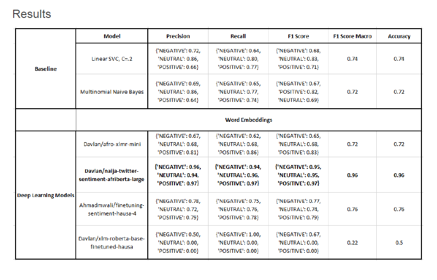  

## Language 5: Algerian Arabic (dz)
Approach
Baseline Models:
Linear Support Vector Classifier (SVC) - It is an algorithm that attempts to find a hyperplane to
maximize the distance between classified samples. It has more flexibility in the choice of
penalties and loss functions. It also scales better to large numbers of samples. The best model
parameters in this case were C = 0.2 with CV=10. Using this model, we got a macro F1 score of
0.42 and an accuracy of 0.59.
Multinomial Naïve Bayes – This model provides an ability to classify data that cannot be
represented numerically. Its main advantage is the significantly reduced complexity. By using
small training sets, the classification can be performed without requiring continuous retraining.
This model when trained on Algerian Arabic dataset gave a macro F1 score of 0.43 and accuracy
of 0.53.
Deep Learning Models:
Davlan/AfroXLMR- mini – which was created by MLM adaptation of the XLM-R-miniLM model
on 17 African languages.
SI2M-Lab/DarijaBERT– DarijaBERT is the first BERT model for the Moroccan Arabic dialect
called “Darija”. It is based on the same architecture as BERT-base, but without the Next
Sentence Prediction (NSP) objective. This model was trained on a total of ~3 Million sequences
of Darija dialect.
Kamel/DarijaBERT– A model that uses the same architecture as BERT-base, but without the
Next Sentence Prediction objective.
alger-ia/dziribert– DziriBERT is a BERT-like model for the Algerian dialect. It has been
pre-trained on oneMillion Algerian tweets and has been evaluated on sentiment, emotion and
topic classification datasets.
Analysis
The analysis was done by comparing the performances of baseline models and deep learning models.
The Baseline models used are Linear SVM and Multinomial Naïve Bayes. The Deep Learning Models
used are AfroXLMR-mini, SI2M-Lab/DarijaBERT, Kamel/DarijaBERT and alger-ia/dziribert. In this
analysis, since the Negative class is dominant, we cannot use the accuracy as the metric even though
the accuracy values are higher than the macro F-1 score. Here, we will use the macro F-1 score as the
metric, we analyze the results below.
The Linear SVC model and Multinomial Naive Bayes model were first run-on preprocessed data and the
Linear SVC model performed slightly better than the Multinomial Naive Bayes model with an F1 score of
0.59.
Of all the models trained on this dataset, we noticed that the pre-trained alger-ia/dziribert model
outperformed all other Baseline as well as Deep Learning models, with an F1 score of 0.61. The biggest
reason for the great performance of this model is that this model has been pre trained on a large
dataset.
In addition to that the S12M-lab and Kamel/DarjiaBERT failed to capture the neutral and positive class in
the dataset as a result the F1 score is 0.22 for both and recall value of 1 for negative class. These
results are poorer than the baseline models.

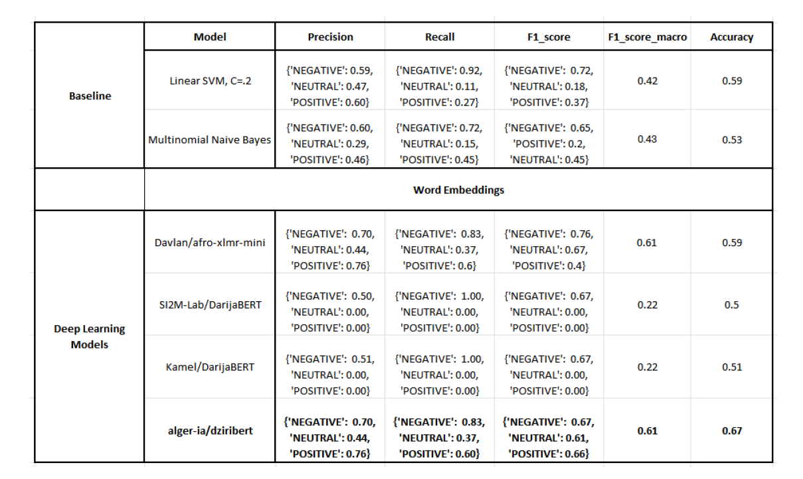  

## Language 6: Mozambican Portuguese (pt)
Approach
The dataset used for the analysis is not very big and has 2 features – text and label. The data was split
into train, dev and test set. The data did not have any missing values.
Class Imbalance - This dataset had class imbalance. The neutral class was dominant and was almost
double that of the positive and negative classes. To deal with this problem, downsampling was
performed on the majority class and the analysis was performed on the balanced data set. The plot of
the distribution of classes before and after downsampling is shown below.
Analysis
For this project, TF-IDF text vectorizer was used to represent the text as a numerical feature. The top
500 features were selected using TF-IDF vectorizer. After converting the text data to numeric form, the
data was standardized and modeling was performed for prediction. The analysis was done by comparing
the performances of baseline models, machine learning models and deep learning models.
Baseline models
Linear SVM(with C=0.2) – the linear SVM model was implemented with C value of 0.2. This model gave
a macro F1 score of 0.52 and accuracy of 0.61
Multinomial Naive Bayes – this model was implemented and it gave a macro F1 score of 0.56 and
accuracy of 0.61.
Machine Learning Models
Random Forest - One of the hyperparameters n_estimators which is the number of trees in the forest is
5 in this analysis. All other parameters were set to default values. The training accuracy for the train set
was 0.92 and the test accuracy was 0.39. This model gave a macro F1 score of 0.34 and accuracy of
0.37.
XGBoost - decision-tree-based ensemble algorithm that uses a gradient boosting framework. The
training accuracy for the train set was 0.70 and the test accuracy was 0.40. This model gave a macro F1
score of 0.33 and accuracy of 0.37.
SVC(C = 5, gamma = 0.0001, kernel = rbf) - The training accuracy for the train set was 0.91 and the
test accuracy was 0.32. This model gave a macro F1 score of 0.30 and accuracy of 0.32.
Multinomial Logistic Regression - classification technique that extends the logistic regression
algorithm to solve multiclass possible outcome problems, given one or more independent variables. The
training accuracy obtained was 0.85 and the test accuracy was 0.34. This model gave a macro F1 score
of 0.34 and accuracy of 0.35.
Deep Learning Models
Davlan/AfroXLMR- large - AfroXLMR-large was created by MLM adaptation of the XLMR-large model
on 17 African languages. This model gave a macro F1 score of 0.34 and accuracy of 0.44.
Davlan/AfroXLMR- small - AfroXLMR-small was created by first reducing the vocabulary token size
XLMR-base from 250K to 70k, followed by MLM adaptation on 17 African languages. This model gave a
macro F1 score of 0.30 and accuracy of 0.42.
Davlan/Naija – It is the first multilingual model based on a fine tuned castorini/afriberta_large model.
The model has been trained to classify tweets into 3 sentiment classes: negative, neutral and positive.
This model gave a macro F1 score of 0.26 and accuracy of 0.50.
Results
In the Mozambican Portuguese language, the neutral class was dominant and almost double that of the
Positive and Negative classes. Hence the Macro Average F1 is used as the evaluation metric. Of all the
models that were implemented, the baseline models performed better than the Machine Learning
models and Deep Learning models. The Multinomial Naive Bayes model performed slightly better than
the Linear SVM model with an F1 score of 0.56. Among the Deep Learning and Machine Learning
models, Naija and Multinomial Logistic Regression performed similarly with an F1 score of 0.34. None of
these models have given significantly good results. The reason for the poor performance of these
models could be due to the availability of very less data. The complete result of all the models are shown
in the figure below.

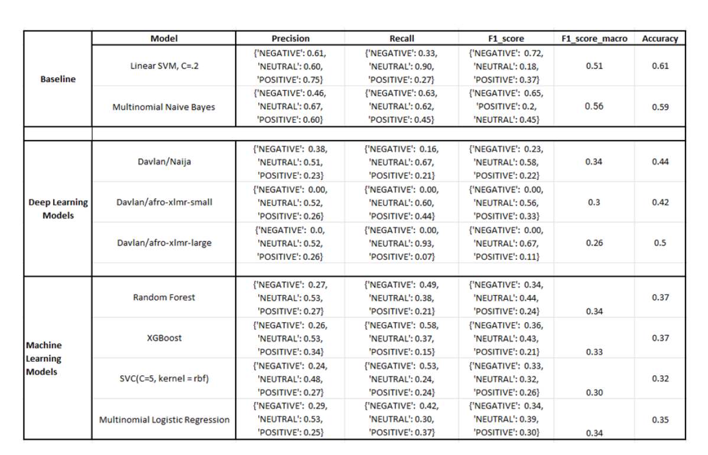  

## Language 7: Yoruba (yo)
Approach
For this language, the dataset when labeled with sentiment classes consists of twice the number of
positive classes than that of negative class labels whereas the neutral class was slightly less than the
positive class. For preprocessing we used label encoding of classes, tokenization,stemming and count
vectorizer was performed. The data was split into train-dev-test.
In label encoding, we started by collection of hashtags depending on the labels i.e positive,negative and
neutral by training text formulations and then followed by its extraction on each label.
Tokenizing of text was performed to remove stop words, we used a gensim model for effective 'alpha' by
tuning its parameters such as size, sg, hs,seed,etc. Further we used stemming to lower inflection in
words from suffixes to prefixes. It gradually helped to clean text from the train,test and validation dataset.
CountVectorizer was used for text analysis, to transform the text into a vector on the basis of the
frequency (count) of each word that occurs in the entire text. This is helpful when we have multiple such
texts, and we wish to convert each word in each text into vectors.
Further we had to standardize the data, as we were using an imbalanced dataset.
Naija-twitter-sentiment-afriberta-large - It is the first multilingual twitter sentiment classification model
for four Nigerian languages. It achieves the state-of-the-art performance for the twitter sentiment
classification task trained on the NaijaSenti corpus. This model has been further fine-tuned on an
aggregation of four Nigerian language datasets obtained from NaijaSenti dataset. This model when train
on our dataset performed very well with a F1 score of 0.93.

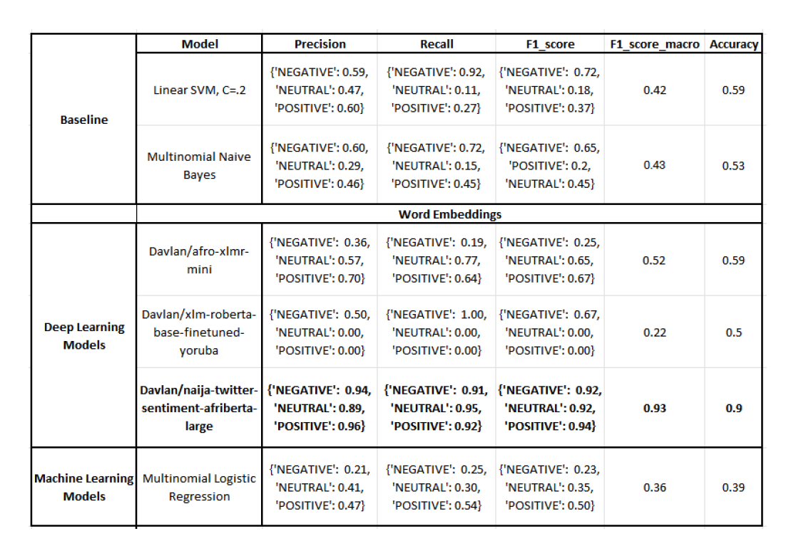  

## Conclusion
- For the four Nigerian languages Hausa (ha) , Igbo (ig) , Nigerian Pidgin (pcm), and Yoruba (yo)
Davlan/naija-twitter-sentiment-afriberta-large which is the xlm-roberta-large model that was
fine-tuned on an aggregation of the above 4 Nigerian languages gave state of the art
performance results.
- For Amharic (am), the Amharic RoBERTa model based on the FLAIR contextual embeddings
gave better results.
- For Algerian Arabic (dz) DziriBERT the transformer-based Language Model that has been
pre-trained specifically for the Algerian Dialect showed better performance
- For Mozambican Portuguese (pt), the linear SVC model performed better than the deep learning
models.
- We achieved better performance than the ones provided in the Afrisenti Semeval competition for
this task for all the languages we worked on.
